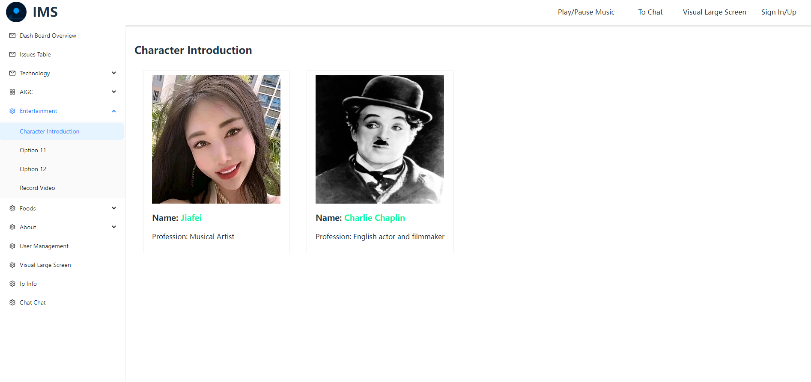
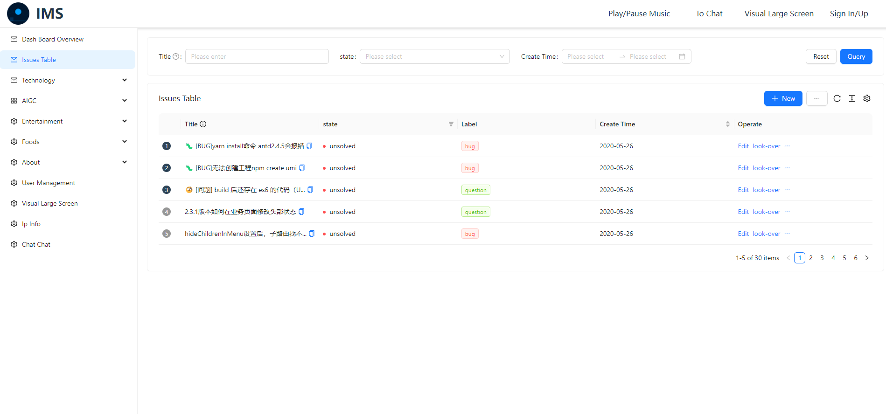
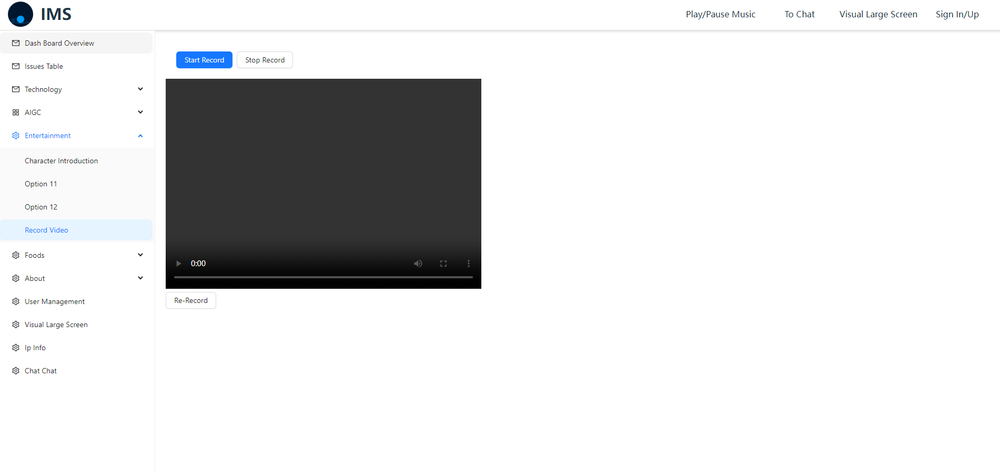
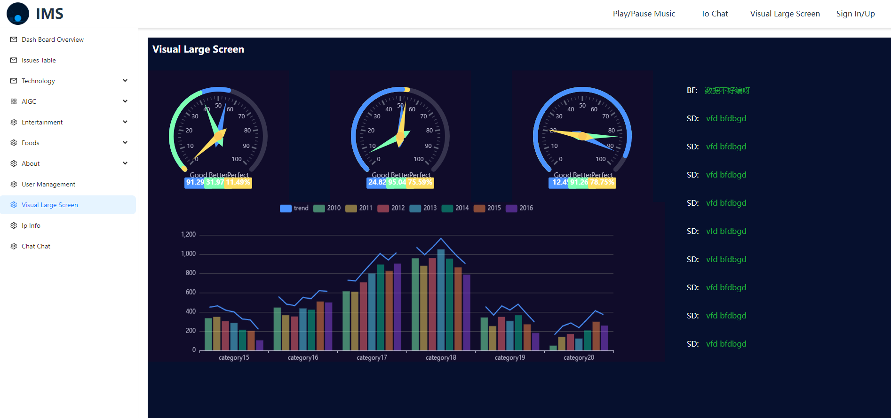
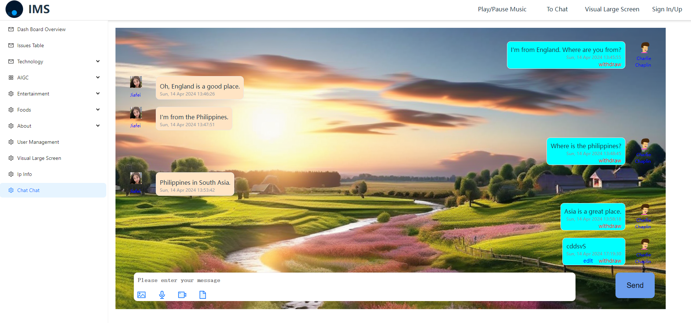

[English](/README.md) | [中文](/README_zh-CN.md) | [Japanese](/README_ja-JP.md) | [German](/README_de.md)

<div align="center">

</div>

# Einführung
- IMS ist ein integriertes Managementsystem.
- IMS ist ein Projekt, das Front- und Backend trennt.
- Frontend: React.
- Backend: Python.
```
Hinweis: Die kommerzielle Nutzung dieses Projektcodes ist untersagt
```

# Merkmale
- Anmeldung und Registrierung, 

- AIGC, 
- Dashboard, 

- Unterhaltung, 

- Essen, 

- Fragenliste, 

- Video aufnehmen, 

- Info， 
- Benutzerverwaltung, 

- IP-Informationsmanagement,
- Großer Visualisierungsbildschirm,

- Chat-Gespräche,

- Spiel Musik,
- Visuelle Bedienung, multifunktionale Sammlung

# Lageradresse
- [gitee](https://gitee.com/xian-jin/IMS)
- [github](https://github.com/LiuXianJing/IMS)

# Projekt ausführen
## Frontend
```bash
pnpm i
```
```bash
pnpm run dev
```
## Bcakend
```bash
pip install flask
```
```bash
pip install flask-mysqldb
```
```bash
pip install -U flask-cors
```
### Server ausführen
```bash
flask run
```

# Technologie-Stack
## frontend
<table>
    <thead>
        <th>Technologie</th><th>Ausführung</th>
    </thead>
    <tbody>
        <tr>
            <td>react</td><td>18.2.0</td>
        </tr>
        <tr>
            <td>typescript</td><td>5.2.2</td>
        </tr>
        <tr>
            <td>react-redux</td><td>9.1.0</td>
        </tr>
        <tr>
            <td>@reduxjs/toolkit</td><td>2.2.3</td>
        </tr>
        <tr>
            <td>react-router-dom</td><td>6.22.3</td>
        </tr>
        <tr>
            <td>axios</td><td>1.6.8</td>
        </tr>
        <tr>
            <td>vite</td><td>5.2.0</td>
        </tr>
        <tr>
            <td>antd</td><td>5.16.0</td>
        </tr>
        <tr>
            <td>echarts</td><td>5.5.0</td>
        </tr>
        <tr>
            <td>less</td><td>4.2.0</td>
        </tr>
        <tr>
            <td>node.js</td><td>20.11.1</td>
        </tr>
        <tr>
            <td>pnpm</td><td>8.7.6</td>
        </tr>
    </tbody>
</table>

## backend
<table>
    <thead>
        <th>Technologie</th><th>Ausführung</th>
    </thead>
    <tbody>
        <tr>
            <td>Python</td><td>3.11.3</td>
        </tr>
        <tr>
            <td>Flask</td><td>3.0.2</td>
        </tr>
        <tr>
            <td>MySQL</td><td>8.0.32</td>
        </tr>
    </tbody>
</table>

# Projektdateibaum
```
IMS
├─ backend
│  ├─ app.py
│  ├─ controller
│  ├─ db
│  │  └─ users.sql
│  ├─ README.md
│  ├─ util
│  │  ├─ get_ip_info.py
│  │  └─ __pycache__
│  │     └─ get_ip_info.cpython-311.pyc
│  └─ __pycache__
│     └─ app.cpython-311.pyc
├─ frontend
│  ├─ .eslintrc.cjs
│  ├─ index.html
│  ├─ package.json
│  ├─ pnpm-lock.yaml
│  ├─ public
│  │  └─ vite.svg
│  ├─ README.md
│  ├─ src
│  │  ├─ api
│  │  │  ├─ axios.ts
│  │  │  ├─ index.ts
│  │  │  └─ request
│  │  │     ├─ ip.ts
│  │  │     └─ sign.ts
│  │  ├─ App.less
│  │  ├─ App.tsx
│  │  ├─ assets
│  │  │  ├─ images
│  │  │  │  └─ logo
│  │  │  │     └─ technology
│  │  │  │        └─ mdn.png
│  │  │  └─ react.svg
│  │  ├─ components
│  │  │  ├─ GraphglGpuLayout
│  │  │  │  ├─ index.less
│  │  │  │  └─ index.tsx
│  │  │  ├─ MyInput
│  │  │  │  ├─ index.less
│  │  │  │  └─ index.tsx
│  │  │  ├─ SummaryGraph
│  │  │  │  ├─ index.less
│  │  │  │  └─ index.tsx
│  │  │  ├─ SwitchLanguageButton
│  │  │  │  ├─ index.less
│  │  │  │  └─ index.tsx
│  │  │  └─ Video
│  │  │     ├─ index.less
│  │  │     └─ index.tsx
│  │  ├─ hooks
│  │  │  ├─ index.tsx
│  │  │  └─ reduxHook.ts
│  │  ├─ index.css
│  │  ├─ main.tsx
│  │  ├─ store
│  │  │  ├─ index.tsx
│  │  │  └─ slices
│  │  │     ├─ index.tsx
│  │  │     └─ signSlice.ts
│  │  ├─ types
│  │  │  ├─ entertainment.ts
│  │  │  ├─ foods.ts
│  │  │  ├─ index.ts
│  │  │  ├─ sign.ts
│  │  │  ├─ technology.ts
│  │  │  └─ user.ts
│  │  ├─ utils
│  │  │  ├─ index.ts
│  │  │  └─ sign.ts
│  │  ├─ views
│  │  │  ├─ About
│  │  │  │  ├─ AboutIMS
│  │  │  │  │  ├─ index.less
│  │  │  │  │  └─ index.tsx
│  │  │  │  └─ AboutMe
│  │  │  │     ├─ index.less
│  │  │  │     └─ index.tsx
│  │  │  ├─ AIGC
│  │  │  │  ├─ BusinessLayout
│  │  │  │  │  └─ index.tsx
│  │  │  │  └─ Introduction
│  │  │  │     └─ index.tsx
│  │  │  ├─ DashBoard
│  │  │  │  └─ Overview
│  │  │  │     ├─ index.less
│  │  │  │     └─ index.tsx
│  │  │  ├─ Entertainment
│  │  │  │  └─ CharacterIntroduction
│  │  │  │     ├─ index.less
│  │  │  │     └─ index.tsx
│  │  │  ├─ Foods
│  │  │  │  └─ MilkPowder
│  │  │  │     └─ index.tsx
│  │  │  ├─ Header
│  │  │  │  ├─ index.less
│  │  │  │  └─ index.tsx
│  │  │  ├─ IpInfo
│  │  │  │  └─ index.tsx
│  │  │  ├─ Menu
│  │  │  │  ├─ index.less
│  │  │  │  └─ index.tsx
│  │  │  ├─ QueryTable
│  │  │  │  └─ index.tsx
│  │  │  ├─ RecordVideo
│  │  │  │  ├─ index.less
│  │  │  │  └─ index.tsx
│  │  │  ├─ SignInOrUp
│  │  │  │  ├─ index.less
│  │  │  │  └─ index.tsx
│  │  │  ├─ Technology
│  │  │  │  └─ Frontend
│  │  │  │     ├─ Frame
│  │  │  │     │  └─ index.tsx
│  │  │  │     ├─ ProgrammingLanguage
│  │  │  │     │  └─ index.tsx
│  │  │  │     └─ Websites
│  │  │  │        ├─ index.less
│  │  │  │        └─ index.tsx
│  │  │  └─ UsersManagement
│  │  │     ├─ EditUserModal
│  │  │     │  └─ index.tsx
│  │  │     ├─ index.less
│  │  │     └─ index.tsx
│  │  └─ vite-env.d.ts
│  ├─ tsconfig.json
│  ├─ tsconfig.node.json
│  └─ vite.config.ts
├─ LICENSE
├─ README.md
├─ README_de.md
├─ README_ja-JP.md
└─ README_zh-CN.md

```